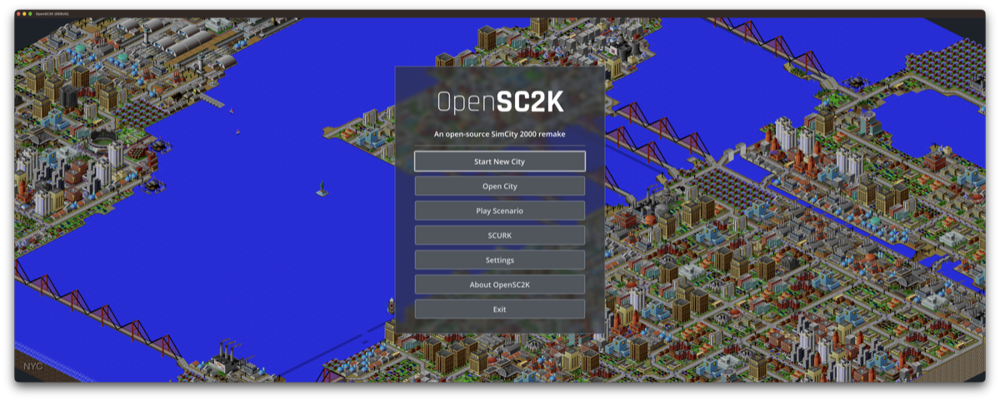
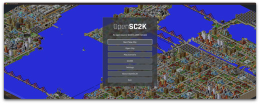
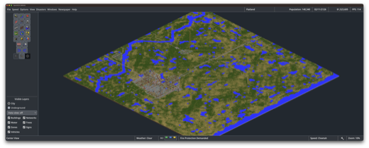
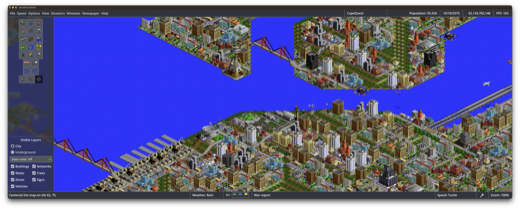
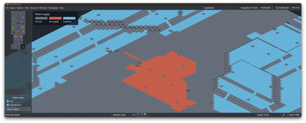
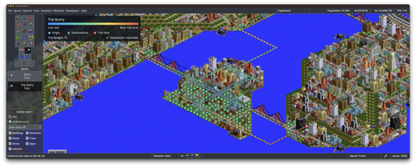
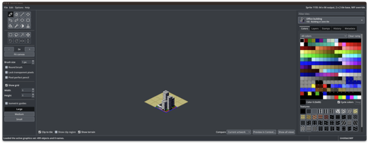

# OpenSC2K

An open-source remake of SimCity 2000, built with Godot.

Join our [Discord community](https://discord.gg/k9S6c3AqcX).

[](.github/screenshots/image1.png)

## Screenshots

Click a thumbnail to view the full screenshot.

<p>
  <a href=".github/screenshots/image1.png"></a>
  <a href=".github/screenshots/image2.png"></a>
  <a href=".github/screenshots/image3.png"></a>
  <br />
  <a href=".github/screenshots/image4.png"></a>
  <a href=".github/screenshots/image5.png"></a>
  <a href=".github/screenshots/image6.png"></a>
</p>

## Run

Download a package from [GitHub Releases](https://github.com/nicholas-ochoa/OpenSC2K/releases).
See the [installation instructions](docs/install.md) for Windows, Linux, and macOS.
The packages include the engine. You do not need to install Godot.

To run from source:

Use Godot 4.7 and provide your own copy of SimCity 2000 Special Edition for Windows 95 (1996).

```sh
godot --path game
```

At the import prompt, navigate to the location where your copy of SimCity 2000 is stored, then select `SIMCITY.EXE`.
The app checks the supported version and imports the game files. These files supply the original graphics, text,
sound, and music.

## Extensions

- Larger cities: 256, 384, and 512 tiles per side, alongside the original 128
- Smaller cities: 16, 32 and 64 tiles per side
- Updated coverage, land value, pollution, crime, and other data maps to be 1:1 resolution with the map, instead of lower resolution
- Massively increased the amount of MicroSims (XMIC) and movable objects (XTHG) that are available to be used in each city
- Improved terrain generator with configurable terrain features supported
- New isometric data views, height map, service coverage, and transport-trip overlays
- More zoom levels, layer controls, and optional dark underground views
- Detailed simulation data available including simulation timings, inspection tools
- Support for external graphics, sound, and music packs

Larger cities and per-tile data maps use `.sc2x` saves. The original game cannot
open these files. Original `.sc2` cities keep their separate compatibility mode.

## sc2kfix

Many fixes identified by [sc2kfix](https://github.com/sc2kfix/sc2kfix) have also
been applied or ported to this codebase. The [sc2kfix MIT notice](LICENSE)
is retained for adapted work.

## Development

Open `game/project.godot` in Godot. Run the checks with:

```sh
tools/validate_project.sh
```

The tests use silent audio. Generated city fixtures are committed. Original-data audits need `references/SIMCITY2000`; renderer and media tests can also need imported packs in `ext/`. See [fixture generation](docs/generated-city-fixtures.md).

## AI-Assisted Development

OpenSC2K is developed with the assistance of AI tools, including large language models (LLMs).
AI is used for tasks such as code generation, refactoring, research, documentation, testing, and debugging.
All architectural decisions, implementations, and contributions are reviewed and directed by the project maintainer.

See [AI-POLICY.md](AI-POLICY.md) for the project's AI usage and contribution policy.


## License

Project code is under the [MIT license](LICENSE).

Bundled [Rajdhani fonts](game/assets/fonts/rajdhani/OFL.txt) and
[Godot WRY](game/addons/godot_wry/LICENSE) retain their own licenses.

The MIT license does not grant rights to the original game or its assets.

This project is not affiliated with or endorsed by Maxis or Electronic Arts.

OpenSC2K is an independently written re-implementation. Compatibility and simulation behavior
have been determined through observation, testing, analysis of game data, publicly available
research, and reverse engineering of the original executable.

No original SimCity 2000 source code or assets is included in OpenSC2K.
