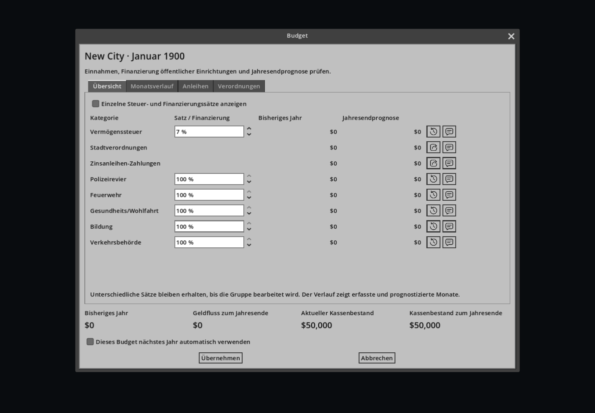
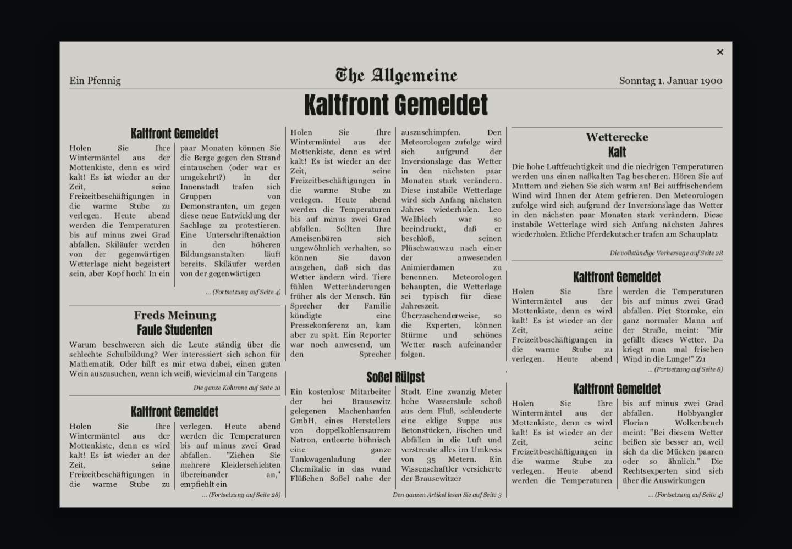

# OpenSC2K — German Translation

OpenSC2K is an open-source remake of SimCity 2000, built with Godot. This fork's
**`feature/german-translation`** branch adds German text and adapts the interface
to translated labels. It is based directly on upstream OpenSC2K 0.3.0.

## What this branch adds

- German menus, settings, tool names, tooltips, city dialogs, budget labels,
  ordinances and month names.
- German newspaper templates, original text resources, matched scenario
  briefings and library text, available from the bundled text catalogs.
- Terminology and wording from the original German SimCity 2000 and SCURK
  editions. New OpenSC2K functions use German translations where the original
  has no corresponding text.
- Toolbar sizing that accommodates long translated names and the original
  artwork, plus localized formatted labels and dialog updates.

The catalogs are [de.po](game/assets/localization/de.po) for the interface and
[de_original.po](game/assets/localization/de_original.po) for original-game text.
Historical spelling and original newspaper price labels are retained. Displayed
Pf/DM labels are text; they do not change the city's economy or numeric values.

## Enable German

1. Open **Settings > General > Language**.
2. Select **Deutsch**. In German, the path is **Einstellungen > Allgemein > Sprache**.
3. Open the city, newspaper or dialog you want to use. The language preference is
   local to your installation; cities do not need conversion.

The bundled German text does **not** require a separate German graphics or data
pack. You still need the supported original game for artwork, sound and music,
as described below. User-written city names and signs remain as entered.

## Scope and compatibility

This is the standalone translation branch. It does not contain the separate
[Visual Enhancements](https://github.com/Realm667/OpenSC2K/tree/feature/visual-enhancements-package)
or [Multiplayer](https://github.com/Realm667/OpenSC2K/tree/feature/multiplayer)
features, and their additional interface text is outside this branch's scope.
Simulation rules, balancing and city file formats are unchanged by the translation.

## Screenshots

Real application captures. Click an image to open it at full size.

**German budget dialog and localized financial labels**

[](.github/screenshots/german-translation/budget.png)

**German newspaper using the bundled text catalog**

[](.github/screenshots/german-translation/newspaper.png)

## Run this branch

Build this branch from source, or use a package explicitly built from it. The
[upstream releases](https://github.com/nicholas-ochoa/OpenSC2K/releases) are the
base game; they do not include this fork's branch-specific additions.

Use **Godot 4.7**, Python 3, and Rust installed through [rustup](https://rustup.rs).
The repository's `rust-toolchain.toml` selects the Rust version. Native audio also
requires CMake. See [installation](docs/install.md) and
[native build details](docs/native-simulation.md) for platform requirements.

```sh
git clone --branch feature/german-translation --single-branch https://github.com/Realm667/OpenSC2K.git OpenSC2K-german-translation
cd OpenSC2K-german-translation
python3 tools/build_native.py
godot --headless --audio-driver Dummy --path game --editor --import
godot --path game
```

On Windows, use `python` if that is the name of your Python executable, and the
path to your Godot executable if `godot` is not on PATH. Wait for the native build
and resource import to finish before starting the game. Opening
`game/project.godot` in the Godot editor also imports resources.

You must provide your own **SimCity 2000 Special Edition for Windows 95 (1996)**.
At the import prompt, select that copy's `SIMCITY.EXE`. The importer checks the
supported version and imports the graphics, text, sound and music locally.
Original game data is not included in the source checkout.

## Upstream project

Based on [nicholas-ochoa/OpenSC2K](https://github.com/nicholas-ochoa/OpenSC2K).
Join the upstream [Discord community](https://discord.gg/k9S6c3AqcX).

## Base-game features

- Larger cities: 256, 384, and 512 tiles per side, alongside the original 128
- Smaller cities: 16, 32 and 64 tiles per side
- Updated coverage, land value, pollution, crime, and other data maps to be 1:1 resolution with the map, instead of lower resolution
- Massively increased the amount of MicroSims (XMIC) and movable objects (XTHG) that are available to be used in each city
- Improved terrain generator with configurable terrain features supported
- New isometric data views, height map, service coverage, and transport-trip overlays
- More zoom levels, layer controls, and optional dark underground views
- Detailed simulation data available including simulation timings, inspection tools
- Support for external graphics, sound, and music packs
- A JavaScript runtime for mods and developer scripts, with game events, a game API, example mods in `examples/mods`, and a Chrome DevTools console. Mods load from the `mods` folder, each in its own sandbox, and the Mods tab of Settings turns them on and off. See [Scripting](docs/scripting.md) and [Mods](docs/mods.md)

Larger cities and per-tile data maps use `.sc2x` saves: ZIP archives with one raw entry per
city structure, city names of up to 64 characters, and signs that can share a tile with any
building. See [the SC2X format](docs/sc2x-format.md). The original game cannot open these
files. Original `.sc2` cities keep their separate compatibility mode until you choose
**Upgrade City to SC2X**. Older `.sc2x` files load as version 4 cities and save as a new copy.

## sc2kfix

Many fixes identified by [sc2kfix](https://github.com/sc2kfix/sc2kfix) have also
been applied or ported to this codebase. The [sc2kfix MIT notice](LICENSE)
is retained for adapted work.

## Development

Open `game/project.godot` in Godot. Run `python3 tools/build_native.py` after each change
to a crate in `native`. It also builds the FluidSynth library, which needs CMake. The validation command also builds the native libraries and runs
their unit tests. See [the native simulation](docs/native-simulation.md),
[the native region builder](docs/native-rendering.md),
[the native formats](docs/native-formats.md), [the native audio](docs/native-audio.md),
[FluidSynth music](docs/fluidsynth.md) and [the native scripting](docs/native-scripting.md) for their layouts. Run the checks with:

```sh
tools/validate_project.sh
```

The tests use silent audio. Generated city fixtures are committed. Original-data audits need `references/SIMCITY2000`; renderer and media tests can also need imported packs in `ext/`. See [fixture generation](docs/generated-city-fixtures.md).

## AI-Assisted Development

OpenSC2K is developed with the assistance of AI tools, including large language models (LLMs).
AI is used for tasks such as code generation, refactoring, research, documentation, testing, and debugging.
All architectural decisions, implementations, and contributions are reviewed and directed by the project maintainer.

See [AI-POLICY.md](AI-POLICY.md) for the project's AI usage and contribution policy.


## License

Project code is under the [MIT license](LICENSE).

Bundled [Rajdhani fonts](game/assets/fonts/rajdhani/OFL.txt) retain their own licenses.

The MIT license does not grant rights to the original game or its assets.

This project is not affiliated with or endorsed by Maxis or Electronic Arts.

OpenSC2K is an independently written re-implementation. Compatibility and simulation behavior
have been determined through observation, testing, analysis of game data, publicly available
research, and reverse engineering of the original executable.

No original SimCity 2000 source code or assets is included in OpenSC2K.
