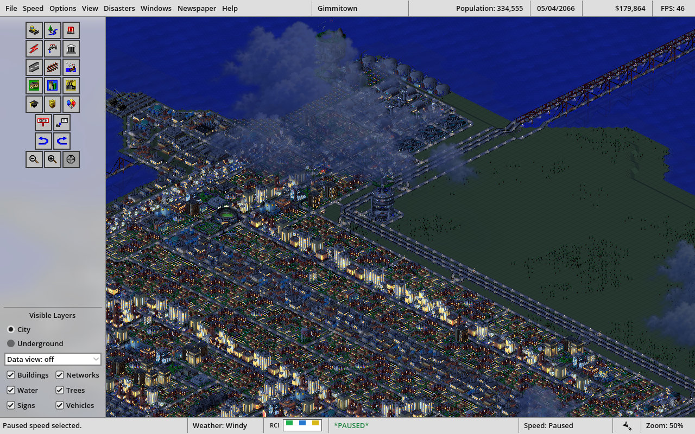
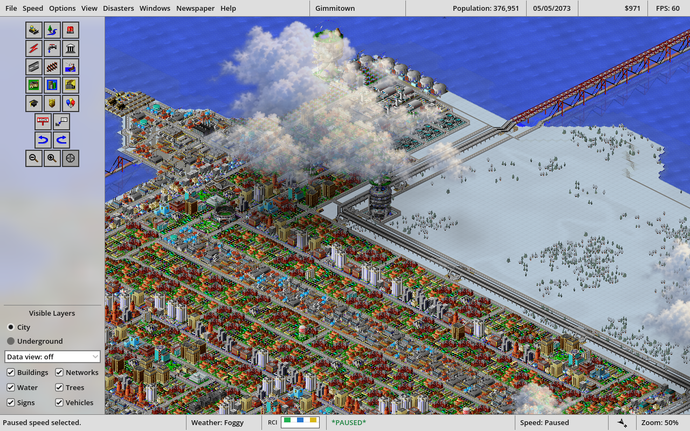
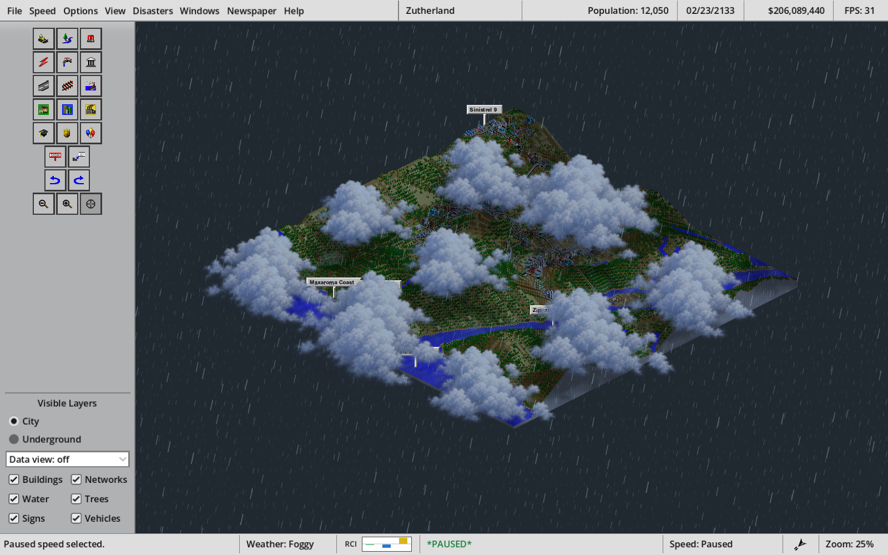

# OpenSC2K — Visual Enhancements

OpenSC2K is an open-source remake of SimCity 2000, built with Godot. This fork's
**`feature/visual-enhancements-package`** branch adds configurable lighting,
weather, seasons, water rendering and city animation on the upstream 0.3.0 base.
These additions affect presentation; they do not change simulation rules,
traffic calculations, disaster damage or city finances.

## Included features

Open **Settings > Visual Enhancements**. The settings are grouped as follows:

| Section | Controls and effects |
| --- | --- |
| Day & Night | A day/night cycle or a fixed time, ambient color and night strength. |
| Lighting | Building and vehicle brightmaps, street and highway lights, ground illumination, glow, a daytime override and a minimum zoom for detail lights. |
| Seasons | City-calendar seasons, an independent visual cycle or a fixed season, with adjustable color and transition strength. |
| Weather & Clouds | Game weather, visual automation or fixed rain, snow and thunderstorms; separate cloud and fog controls, cloud shadows and coverage. Storms include ambient wind, rain and thunder audio; dry thunderstorms omit rain. |
| Environment | Connected forests, tree variants, subtle ground variation, water reflections, underwater terrain, waves, coastal surf and seasonal water color. |
| Traffic & Movement | Decorative individual cars and pedestrians, smoother existing vehicles and transparent aircraft shadows. |
| Disaster Effects | Extra fire and impact light, dust, crowds, tornado motion and earthquake shake. Volcanic clouds use warm colors; pollution and toxic effects use green. |
| Animation | Transition blending, linkage to game speed and pause behavior for environment cycles. |
| Custom Graphics | Optional color LUT and brightmap overrides. Standard effects use the included resources. |

The scrolling city in the main menu also uses the visual settings. Each launch
starts its preview with a randomized time, season and weather, without replacing
the user's stored choices for a playable city.

## Try the effects

1. Load an existing city, or finish terrain editing and **found a new city**.
   The terrain editor does not show the full playable-city weather environment.
2. Open **Settings > Visual Enhancements** and enable the relevant sections.
   Weather and clouds have separate switches; fog belongs to Clouds.
3. For a reproducible night view, choose a fixed time in **Day & Night** and enable
   **Lights and brightmaps** in **Lighting**. Adjust ambient light, glow and ground
   lighting independently.
4. For a seasonal or weather preview, choose **Fixed season** or **Fixed weather**.
   Fixed snow can be displayed in any season. These controls do not rewrite the
   simulation's weather or calendar.
5. Use the category reset and Undo controls to compare settings. Weather and
   cloud animation pause with the game; other environment cycles use the pause
   and speed options in **Animation**.

Standard brightmaps are included in
[game/assets/brightmaps/standard](game/assets/brightmaps/standard).
Leave the custom graphics paths empty to use the built-in resources. The custom
brightmap folder is an override, not a required external download.
Building brightmaps follow the city's power state: unpowered buildings do not
emit window light. This reads existing power information without changing supply.

## Rendering and performance

Lighting placement follows city geometry, including diagonal routes and slopes.
Static visual layers are cached, and prepared graphics-size variants can be
retained across zoom changes. Loading a city or invalidating affected geometry
can still require visual preparation; caching does not make every effect free.

**Detail lights from zoom** deliberately hides fine lighting below the selected
zoom level (50% by default). Lower that threshold to show detail lights farther
out. For less rendering work, reduce cloud coverage, decorative traffic or
lighting effects. Performance depends on city size, viewport and enabled effects;
this branch does not promise a fixed frame rate.

## Scope and compatibility

Preferences are local presentation settings, not changes to city documents.
The package includes the water-surface/depth work and its related rendering fixes.
This standalone branch does not include
[German Translation](https://github.com/Realm667/OpenSC2K/tree/feature/german-translation)
or [Multiplayer](https://github.com/Realm667/OpenSC2K/tree/feature/multiplayer).
The underlying upstream SC2/SC2X compatibility rules still apply.

## Screenshots

Real application captures. Click an image to open it at full size.

**Gimmitown at night: brightmaps, street lighting and clouds**

[](.github/screenshots/visual-enhancements-package/night-city.png)

**Winter terrain, clouds and the enhanced water surface**

[](.github/screenshots/visual-enhancements-package/winter-water.png)

**Rain and storm clouds over a developed city**

[](.github/screenshots/visual-enhancements-package/thunderstorm.png)

## Run this branch

Build this branch from source, or use a package explicitly built from it. The
[upstream releases](https://github.com/nicholas-ochoa/OpenSC2K/releases) are the
base game; they do not include this fork's branch-specific additions.

Use **Godot 4.7**, Python 3, and Rust installed through [rustup](https://rustup.rs).
The repository's `rust-toolchain.toml` selects the Rust version. Native audio also
requires CMake. See [installation](docs/install.md) and
[native build details](docs/native-simulation.md) for platform requirements.

```sh
git clone --branch feature/visual-enhancements-package --single-branch https://github.com/Realm667/OpenSC2K.git OpenSC2K-visual-enhancements-package
cd OpenSC2K-visual-enhancements-package
python3 tools/build_native.py
godot --headless --audio-driver Dummy --path game --editor --import
godot --path game
```

On Windows, use `python` if that is the name of your Python executable, and the
path to your Godot executable if `godot` is not on PATH. Wait for the native build
and resource import to finish before starting the game. Opening
`game/project.godot` in the Godot editor also imports resources.

You must provide your own **SimCity 2000 Special Edition for Windows 95 (1996)**.
At the import prompt, select that copy's `SIMCITY.EXE`. The importer checks the
supported version and imports the graphics, text, sound and music locally.
Original game data is not included in the source checkout.

## Upstream project

Based on [nicholas-ochoa/OpenSC2K](https://github.com/nicholas-ochoa/OpenSC2K).
Join the upstream [Discord community](https://discord.gg/k9S6c3AqcX).

## Base-game features

- Larger cities: 256, 384, and 512 tiles per side, alongside the original 128
- Smaller cities: 16, 32 and 64 tiles per side
- Updated coverage, land value, pollution, crime, and other data maps to be 1:1 resolution with the map, instead of lower resolution
- Massively increased the amount of MicroSims (XMIC) and movable objects (XTHG) that are available to be used in each city
- Improved terrain generator with configurable terrain features supported
- New isometric data views, height map, service coverage, and transport-trip overlays
- More zoom levels, layer controls, and optional dark underground views
- Detailed simulation data available including simulation timings, inspection tools
- Support for external graphics, sound, and music packs
- A JavaScript runtime for mods and developer scripts, with game events, a game API, example mods in `examples/mods`, and a Chrome DevTools console. Mods load from the `mods` folder, each in its own sandbox, and the Mods tab of Settings turns them on and off. See [Scripting](docs/scripting.md) and [Mods](docs/mods.md)

Larger cities and per-tile data maps use `.sc2x` saves: ZIP archives with one raw entry per
city structure, city names of up to 64 characters, and signs that can share a tile with any
building. See [the SC2X format](docs/sc2x-format.md). The original game cannot open these
files. Original `.sc2` cities keep their separate compatibility mode until you choose
**Upgrade City to SC2X**. Older `.sc2x` files load as version 4 cities and save as a new copy.

## sc2kfix

Many fixes identified by [sc2kfix](https://github.com/sc2kfix/sc2kfix) have also
been applied or ported to this codebase. The [sc2kfix MIT notice](LICENSE)
is retained for adapted work.

## Development

Open `game/project.godot` in Godot. Run `python3 tools/build_native.py` after each change
to a crate in `native`. It also builds the FluidSynth library, which needs CMake. The validation command also builds the native libraries and runs
their unit tests. See [the native simulation](docs/native-simulation.md),
[the native region builder](docs/native-rendering.md),
[the native formats](docs/native-formats.md), [the native audio](docs/native-audio.md),
[FluidSynth music](docs/fluidsynth.md) and [the native scripting](docs/native-scripting.md) for their layouts. Run the checks with:

```sh
tools/validate_project.sh
```

The tests use silent audio. Generated city fixtures are committed. Original-data audits need `references/SIMCITY2000`; renderer and media tests can also need imported packs in `ext/`. See [fixture generation](docs/generated-city-fixtures.md).

## AI-Assisted Development

OpenSC2K is developed with the assistance of AI tools, including large language models (LLMs).
AI is used for tasks such as code generation, refactoring, research, documentation, testing, and debugging.
All architectural decisions, implementations, and contributions are reviewed and directed by the project maintainer.

See [AI-POLICY.md](AI-POLICY.md) for the project's AI usage and contribution policy.


## License

Project code is under the [MIT license](LICENSE).

Bundled [Rajdhani fonts](game/assets/fonts/rajdhani/OFL.txt) retain their own licenses.

The MIT license does not grant rights to the original game or its assets.

This project is not affiliated with or endorsed by Maxis or Electronic Arts.

OpenSC2K is an independently written re-implementation. Compatibility and simulation behavior
have been determined through observation, testing, analysis of game data, publicly available
research, and reverse engineering of the original executable.

No original SimCity 2000 source code or assets is included in OpenSC2K.
